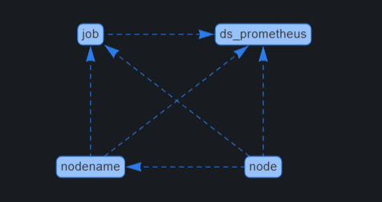

# resouce dashboard:

 
  
<h2>Metrics used</h2>

    <ul>
      <li>node_cpu_seconds_total</li>
      <li>node_disk_read_bytes_total</li>
      <li>node_disk_reads_completed_total</li>
      <li>node_disk_writes_completed_total</li>
      <li>node_disk_written_bytes_total</li>
      <li>node_filesystem_avail_bytes</li>
      <li>node_filesystem_size_bytes</li>
      <li>node_load1</li>
      <li>node_load15</li>
      <li>node_load5</li>
      <li>node_memory_Buffers_bytes</li>
      <li>node_memory_Cached_bytes</li>
      <li>node_memory_MemAvailable_bytes</li>
      <li>node_memory_MemFree_bytes</li>
      <li>node_memory_MemTotal_bytes</li>
      <li>node_memory_SReclaimable_bytes</li>
      <li>node_memory_SwapFree_bytes</li>
      <li>node_memory_SwapTotal_bytes</li>
      <li>node_network_receive_bytes_total</li>
      <li>node_network_transmit_bytes_total</li>
    </ul>
  

 
  
<h2>Dependencies of variables</h2>

   

 
  
<h2>Required plugins</h2>

   

